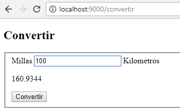

# Conversor de medidas en XTrest

[](https://travis-ci.org/uqbar-project/eg-conversor-xtrest)


 Conversor de unidades de medida que trabaja con servicios REST + templating a html


# Modo de uso

## Cómo levantar

### Opción A: Desde Eclipse

1. Importar este proyecto en Eclipse como **Maven project**.
2. Ejecutar `org.uqbar.conversor.ConversorController`, que levanta servidor en el puerto 9000.

### Opción B: Desde línea de comandos

1. Generar jar con dependencias: `mvn clean compile assembly:single`
2. Ejecutar el jar generador: `java -jar target/eg-conversor-xtrest-0.0.1-SNAPSHOT-jar-with-dependencies.jar`

Esta opción requiere menos recursos de sistema porque no es necesario ejecutar Eclipse.

## Cómo probar



La URL http://localhost:9000 nos lleva a la página conversor.html, y al cargar la URL http://localhost:9000/conversor.html visualizamos la página donde podemos ingresar el valor en millas.

Al hacer click en el botón Convertir, se hace un submit del formulario, lo que provoca una llamada a http://localhost:9000/convertir. Vemos la definición del formulario:

```html
<form action="/convertir" method="post">
	...
	<button type="submit" class="btn btn-primary">Convertir</button>
```

Aquí entra en juego el servidor jetty que recibe el pedido y lo redirige al controller XTrest:

```xtend
	@Post("/convertir")
	def convertir(String millas) {
		render('conversor.html', #{
			"millas" -> millas,
			"kilometros" -> Integer.valueOf(millas) * 1.609344
		})
	}
```

Vemos que el método convertir recibe como parámetro millas, que es un input type="text" del form HTML:

```html
<input 
	required="true"
	name="millas" class="form-control" 
	placeholder="23"
	autofocus="autofocus" value="{{millas}}">
```

Al hacer submit del form vía POST, se pasa por parámetro el valor millas (atributo _name_ del texto).

Lo que entonces hace el servidor REST es mostrar el html (_render_) reemplazando los valores millas y kilómetros por el mapa de valores correspondiente.

Cuando iniciamos la aplicación hacemos un pedido vía GET al conversor, lo que provoca que muestre las millas en 0:

```xtend
	@Get("/conversor")
	def index() {
		val data = #{
			"millas" -> "0",
			"kilometros" -> "<< introducir millas >>"
		}
		render('conversor.html', data)
	}
```

